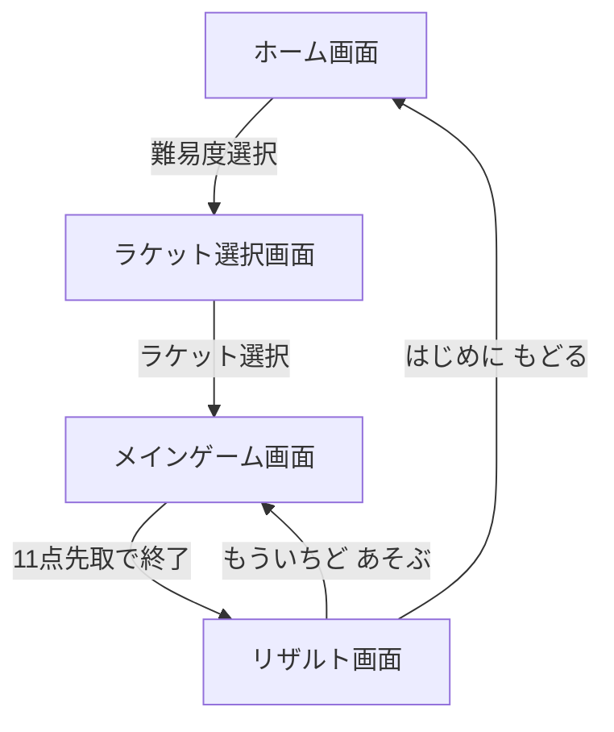

# 画面仕様書：どきどきピンポン

## 1. 画面一覧

- **ホーム画面（難易度選択）**：アプリ起動時の画面
- **ラケット選択画面**：難易度選択後のラケット選択画面
- **メインゲーム画面**：実際にプレイする画面
- **リザルト画面（結果発表）**：勝敗が決まった後の画面

---

## 2. 各画面の詳細設計

### 2.1 ホーム画面

パステルカラーの背景に、丸みのある大きなボタンを配置します。

#### レイアウト構成

- **ヘッダー**
  - タイトルロゴ「どきどきピンポン」を中央に配置
  - 虹色やキラキラの装飾を施す

- **メインエリア**
  - 縦に3つの難易度ボタンを配置
    - **やさしい**（ピンク・花のアイコン）
    - **ふつう**（水色・星のアイコン）
    - **むずかしい**（紫・カミナリのアイコン）
  - キラキラしたアニメーション付きのスタートボタン

- **フッター**
  - 「あそびかた」などの簡単な説明テキスト（ひらがな）

#### 操作

- 方向キーまたはマウスで難易度を選択
- マウスクリックまたはスペース/エンターキーで確定

---

### 2.2 ラケット選択画面

自分好みのラケットを選択する画面です。

#### レイアウト構成

- **ヘッダー**
  - 「ラケットを えらんでね」などのメッセージ

- **メインエリア**
  - 3種類のラケットを横並びまたは縦並びで表示
    - **ノーマルラケット**：バランスの良い性能
    - **スピードラケット**：スマッシュの速度が1.2倍になるが当たり判定が20%低下
    - **ワイドラケット**：当たり判定が1.2倍になるが移動速度が20%低下
  - 各ラケットの説明文（ひらがな）

- **フッター**
  - 選択ボタンまたは自動でゲーム画面へ遷移

#### 操作

- 方向キーまたはマウスでラケットを選択
- マウスクリックまたはスペース/エンターキーで確定

---

### 2.3 メインゲーム画面

ゲームの中心となる画面です。ReactのState（状態）でリアルタイムに数値を更新します。

#### レイアウト構成

- **上部：スコアエリア**
  - 左側：自分のスコア（ピンクのハートアイコン × 数）
  - 右側：CPUのスコア（青のハートアイコン × 数）

- **中央：ゲームフィールド（Canvas 1280×720px）**
  - 背景：薄いドット柄や星空などのパステルカラー
  - 卓球台：中央に配置
  - **ラケット（左）**：プレイヤー操作。リボンのついた可愛いラケット
  - **ラケット（右）**：CPU操作。雲のような形のラケット
  - **ボール**：通常は白いボール、変化時はハート型、イチゴ、星、キャンディ、リボンのイラスト

- **演出**
  - ボールがラケットに当たると「キラキラ粒子」が出るパーティクル演出（星やハートが全方位に散らばる）
  - 得点時に「やったね！」「すごい！」などのポジティブなフィードバックを表示
  - ボール変化時にメッセージ表示（例：「ボールがうちやすくなったよ！」「ボールがうちにくくなったよ！」）
  - ハートのボールが分裂して相手コートにバウンドした際に、本物のボールだけ「きらり」と光る演出あり

#### 操作

- **キャラクター操作**：左右方向キーでキャラクターを移動
- **ラケット操作**：クリックまたはスペースキーでボールを打ち返す（スマッシュ）

---

### 2.4 リザルト画面

プレイ結果を大きく褒める、または励ます画面です。

#### レイアウト構成

- **メッセージエリア**
  - **勝利時**：「かち！ すごいね！ おめでとう！」（王冠のイラスト）
    - 紙吹雪とともに「よくがんばったね！」等の誉め言葉を表示
  - **敗北時**：「おしい！ つぎは かてるよ！」（応援するイラスト）

- **アクションボタン**
  - **「もういちど あそぶ」**：同じ難易度・ラケットでゲーム再開
  - **「はじめに もどる」**：ホーム画面へ遷移

#### 操作

- 方向キーまたはマウスでボタンを選択
- マウスクリックまたはスペース/エンターキーで確定

---

## 3. 画面遷移図

---

## 4. UI/UXのこだわりポイント（女児向け）

### 4.1 フォント

- ブラウザ標準のゴシックではなく、Google Fontsの『Zen Maru Gothic』などを指定
- 全体的に柔らかい印象にする
- すべて「ひらがな・カタカナ」で表記

### 4.2 配色

- パステルピンク、ラベンダー、ミントグリーンを基調とする
- 背景は薄いドット柄や星空などの優しいデザイン

### 4.3 アニメーション

- ボタンにマウスを乗せた（または指で触れた）時に、ぷるんと震えるようなアニメーションをCSSで実装
- キラキラしたアニメーション付きのスタートボタン
- ヒット時のパーティクル演出（星やハートが全方位に散らばる）

### 4.4 音響（検討事項）

- 叩いた時の「ポーン」という音を、可愛い「ピコーン」や「シャリーン」という音に設定
- ヒット音、得点音、背景音など
- 使用する音源ファイルは未定（最後に決める）

### 4.5 アクセシビリティ

- ボタンを大きく配置し、押し間違いを防ぐ
- 少ないキーで完結するシンプルなインターフェース
- 視覚的なフィードバックを充実させる

---

## 5. 表示要素の詳細

### 5.1 ゲーム画面で表示される要素

- **必須表示要素**
  - 卓球台
  - お互いのラケット
  - ボール
  - 得点版

- **背景要素**
  - その他は風景として表示（キャラクターは表示しない）

### 5.2 ボールの視覚的変化

- **通常**：薄オレンジ色のボール（ピンポン玉）
- **イチゴ**：イチゴのイラスト
- **ハート**：ハートのイラスト（打つと3つに分身）
- **星**：星のイラスト
- **キャンディ**：キャンディのイラスト
- **リボン**：リボンのイラスト

---
